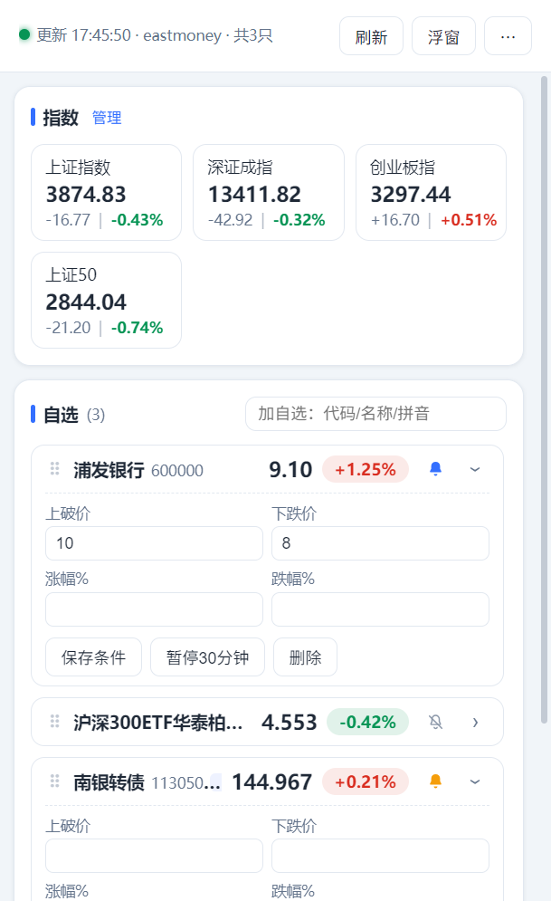
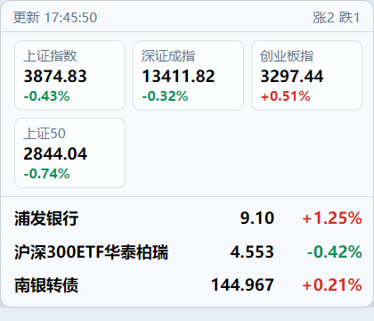
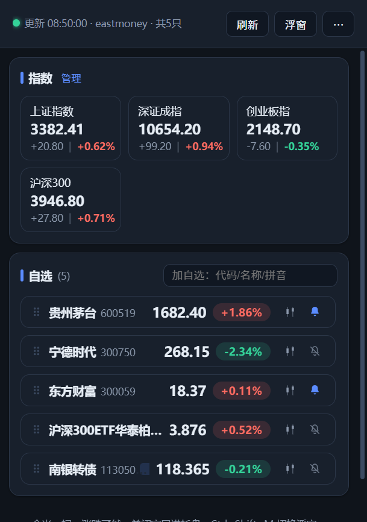
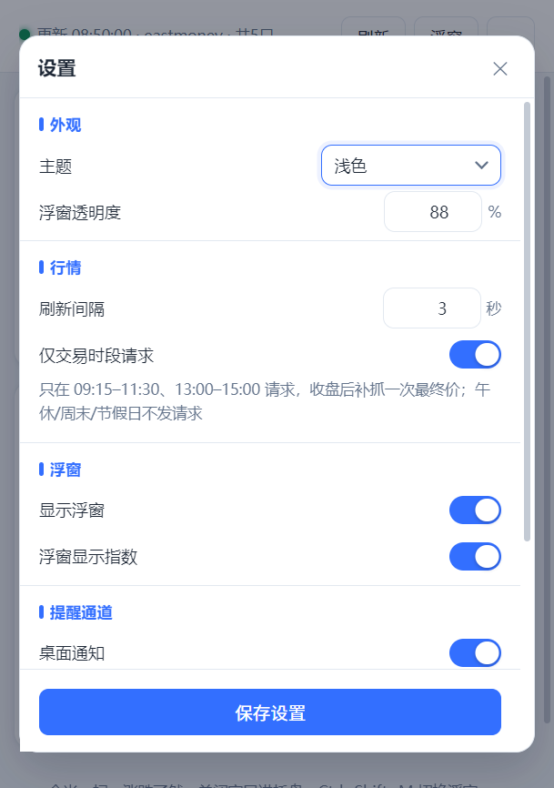
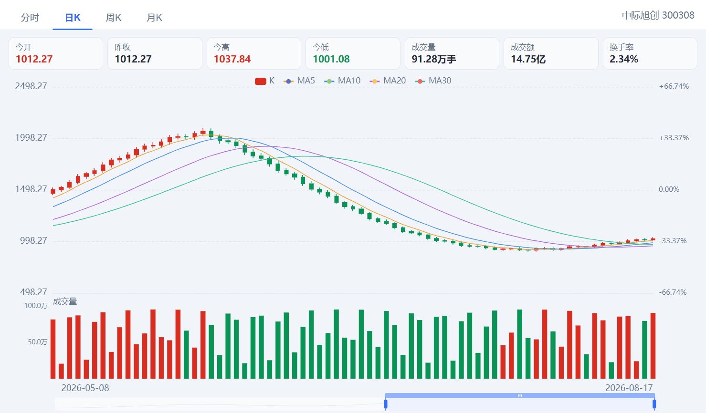
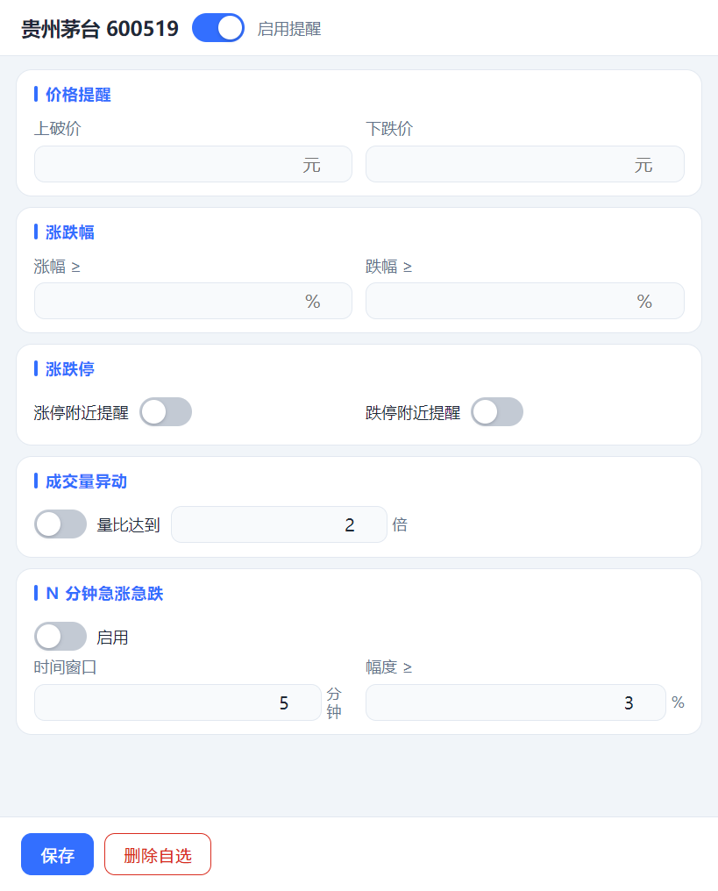

# 工位看盘

隐蔽、轻量的 Windows 桌面股票行情助手。常驻系统托盘，提供自选行情、指数看板、桌面浮窗与价格提醒。

<p align="center">
  <a href="https://github.com/lyhxx/gongwei-stocks-desktop/actions/workflows/build-win.yml"></a>
  
  
</p>

---

## 简介

工位看盘是一个面向 A 股自选股的桌面行情工具。它以托盘常驻的方式运行，把「当前价格、涨跌幅、是否触发提醒」压缩到一块常驻的小浮窗里，需要时展开查看细节，不需要时收起或隐藏。

几项设计取向：

- **不打扰**：不登录、不上报、无账号体系，行情直连公开接口，配置只存本机
- **省流量**：只在 A 股交易时段请求，收盘后补抓一次最终价，午休、周末、节假日不发请求
- **容错**：三条行情通道并行取数、按只合并，单条通道故障不影响整体
- **网络友好**：请求走系统网络栈，自动使用系统代理与 PAC，公司网络下也能正常工作

## 界面

| 主界面 | 桌面浮窗 |
| --- | --- |
|  |  |

| 深色主题 | 设置 |
| --- | --- |
|  |  |

| K 线 / 分时 | 价格提醒 |
| --- | --- |
|  |  |

## 功能

| 模块 | 说明 |
| --- | --- |
| 自选行情 | 代码 / 名称 / 拼音缩写联想添加；支持股票、ETF、LOF、可转债，按品种显示小数位 |
| K 线 / 分时 | 自选行 K 线图标弹独立窗口；分时/日K/周K/月K，含均线与成交量副图 |
| 指数看板 | 内置 14 个常用指数，卡片横排，可自行勾选启停 |
| 桌面浮窗 | 透明置顶小窗，指数在上、个股在下；指数显隐可在设置中开关 |
| 价格提醒 | 独立窗口配置，含启用开关；同一只 5 分钟内只提醒一次 |
| 提醒通道 | Windows 桌面通知与提示音，可分别试听 |
| 交易时段感知 | 仅交易时段请求，收盘后补抓最终价；非交易时段状态栏明确标注 |
| 网络代理 | 跟随系统 / 不使用 / 手动指定，内置连通性测试 |
| 外观 | 跟随系统 / 浅色 / 深色，窗口标题栏同步变色 |
| 常驻与热键 | 托盘常驻，关闭窗口不退出；`Ctrl+Shift+M` 全局切换浮窗 |
| 排序 | 自选列表与指数卡片均支持按住拖动调整顺序 |
| 检查更新 | 启动后静默检查，也可手动检查并跳转下载 |
| 诊断 | 一键查看数据来源、各通道报错、当前代理走向；另有接口自检 |

提醒条件：上破价、下跌价、涨幅、跌幅、涨跌停、成交量异动（量比）、N 分钟急涨急跌。

## 安装

到 [Releases](https://github.com/lyhxx/gongwei-stocks-desktop/releases) 下载：

| 类型 | 文件名 | 说明 |
| --- | --- | --- |
| 安装版 | `*-setup-x64.exe` | 安装到系统，创建开始菜单与桌面快捷方式 |
| 绿色单文件 | `*-portable.exe` | 免安装，双击即用 |
| 绿色解压版 | `*-win-x64.zip` | 免安装，解压后运行 |

完整文件名形如 `gongwei-stocks-desktop-1.1.0-setup-x64.exe`。文件名使用英文，以兼容发布平台的资源命名规则；程序内显示名与快捷方式均为「工位看盘」。

## 使用

### 常用操作

| 操作 | 方式 |
| --- | --- |
| 添加自选 | 自选标题右侧输入框，输入代码 / 名称 / 拼音后回车或点选下拉项 |
| 调整顺序 | 按住自选行或指数卡片拖动（按钮与输入框区域除外） |
| 切换浮窗 | `Ctrl+Shift+M`，或主界面顶栏「浮窗」按钮 |
| 隐藏浮窗 | `Esc` |
| 查看K线 | 股票行尾的 K 线图标，独立窗口内切换 分时 / 日K / 周K / 月K |
| 设置提醒 | 股票行尾的铃铛打开「价格提醒」窗口：蓝色为已开启、灰色带斜杠为关闭 |
| 浮窗右键 | 刷新、显示主窗口、设置、隐藏浮窗、停用浮窗、退出 |
| 查看诊断 | 点击状态栏左侧圆点，或异常时出现的黄色提示 |
| 退出程序 | 托盘图标右键 → 退出 |

### 数据说明

行情按 **东方财富 → 新浪 → 腾讯** 三路并行拉取、按只合并：任一路先返回即采用，并可相互补全，单条通道故障不影响其他通道。搜索按 **腾讯 → 东财 → 新浪 → 雪球 → 纯代码直通** 多层兜底。

| 通道 | 地址 | 覆盖范围 |
| --- | --- | --- |
| 东方财富 | `push2.eastmoney.com` | A 股 / 港股 / 美股 / 指数（主力） |
| 新浪 | `hq.sinajs.cn` | A 股 / 指数 |
| 腾讯 | `qt.gtimg.cn` | A 股 / 指数 |

东方财富备用域名 `push2delay.eastmoney.com`；新浪与腾讯优先使用 HTTPS。所有请求均指向公开行情接口，仅用于个人学习与自用。

K 线与分时走东方财富历史接口 `push2his.eastmoney.com` / `push2.eastmoney.com`，仅在打开图表时按需请求。

### 交易时段

请求时间按北京时间判断，与本机时区无关：

| 时段 | 行为 |
| --- | --- |
| 09:15–11:30、13:00–15:00 | 按设定间隔请求 |
| 11:30–13:00 午休 | 不请求 |
| 15:00–15:30 | 补抓一次当日最终价 |
| 15:30 之后、周末、法定节假日 | 不请求 |

非交易时段状态栏会显示「午间休市」「已收盘」「周末休市」等状态，数据不再变化属正常现象。该行为可在设置中关闭。

## 常见问题

**状态显示「来源 none」并提示异常？**
三个通道同时失败，通常是网络问题：断网、切换网络，或公司网络拦截了行情站点。点击状态栏圆点查看诊断；若已配置代理，可先用设置中的「测试连通性」确认哪条通道不通。

**个别指数一直显示 `--`？**
少数指数仅由单一通道提供（例如中证 2000 依赖东方财富）。该通道不可用时这几个指数会显示 `--`，其余指数正常。

**首次运行提示「未知发布者」？**
安装包未购买代码签名证书，Windows SmartScreen 会给出该提示。点击「更多信息 → 仍要运行」即可。

**关闭窗口后程序去哪了？**
在系统托盘。单击托盘图标显示 / 隐藏主窗口，右键可退出。

**数据会上传吗？**
不会。程序不向任何服务器上传用户数据，配置仅保存在本机 `%APPDATA%\工位看盘\gongwei-stocks.json`。

## 路线图

### 已完成

- [x] ETF / 场内基金 / 可转债适配
- [x] 交易时段与交易日感知
- [x] 网络代理与连通性测试
- [x] 自选与指数拖拽排序
- [x] 应用内检查更新
- [x] 深色主题（含窗口标题栏）
- [x] K 线 / 分时图 — 自选行点 K 线图标查看分时、日K、周K、月K
- [x] 价格提醒增强 — 涨跌停、成交量异动（量比）、N 分钟急涨急跌；独立提醒窗口

### 计划中

- [ ] **分组管理** — 多组自选列表，浮窗按组切换
- [ ] **持仓与盈亏** — 记录成本与数量，统计今日盈亏、持仓盈亏
- [ ] **老板键** — 一键隐藏全部窗口，托盘图标可伪装
- [ ] **数据备份** — 自选与设置导出 / 导入
- [ ] **基金折溢价** — ETF / LOF 的 IOPV 与折溢价率
- [ ] **绿色版数据本地化** — 便携版配置写入程序同级目录
- [ ] **自动更新** — 接入 `electron-updater` 静默更新
- [ ] **跨平台** — macOS / Linux 适配（当前仅 Windows）

## 项目结构

```
src/
  main.js            主进程：窗口、托盘、热键、行情调度、告警、IPC
  preload.js         contextBridge 桥（渲染层唯一入口）
  common/            与 Electron 解耦的纯逻辑，均可单测
    defaults.js      默认配置与内置指数
    providers.js     行情 / 搜索 Provider，含解析与多通道合并
    http.js          统一请求出口（应用内使用 net.fetch）
    proxy.js         代理模式校验与状态描述
    market-hours.js  交易时段、交易日与请求调度决策
    version.js       版本比较与发布资源挑选
    order.js         排序校验与重排
  renderer/          主窗口
  float/             桌面浮窗
  chart/             K 线独立窗口（chart.html + chart.js）
  alert/             价格提醒独立窗口（alert.html + alert.js）
  vendor/            第三方前端资源（echarts.min.js，K 线图用）
test/                自测脚本（npm test）
scripts/             构建辅助脚本
docs/                开发文档与界面截图
build/               应用图标
```

## 开发

- 环境要求：Node.js 20+，Windows
- 安装依赖并运行：`npm install && npm start`
- 自测：`npm test`（打包配置校验 + 静态审计 + 行情/提醒单测 + DOM 交互测试）
- 打包：`npm run dist`（一次产出安装版 / 绿色单文件 / 绿色解压版）

架构说明、IPC 契约、存储结构、扩展方式与踩坑记录见 [开发文档](docs/DEVELOPMENT.md)；版本变更见 [CHANGELOG.md](CHANGELOG.md)。

## 许可

[MIT](LICENSE)
